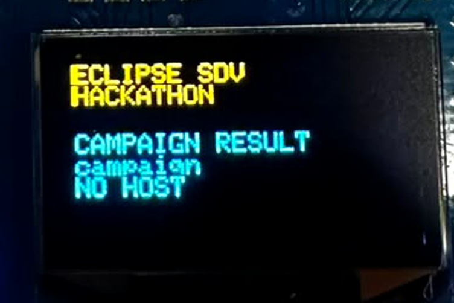
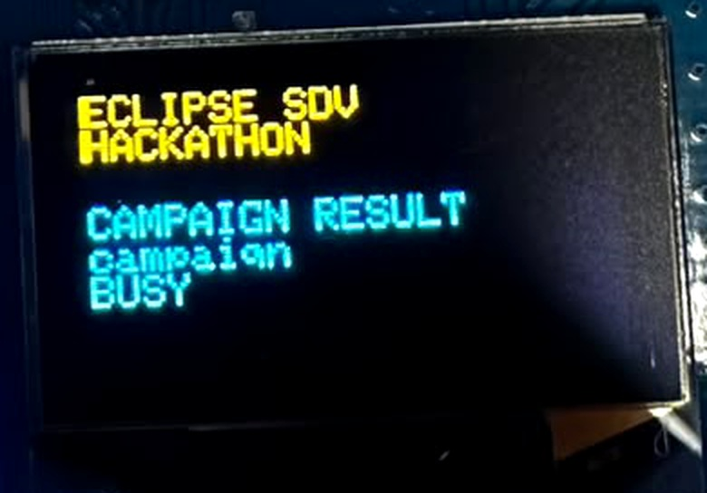
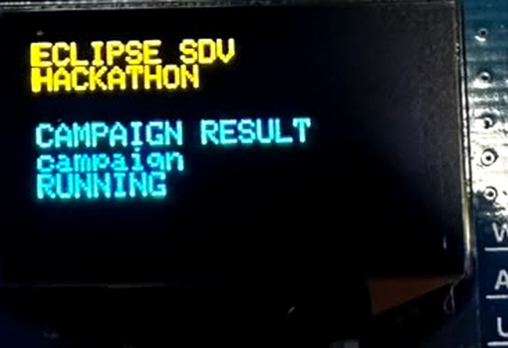

# AZ3166 and OTA Outlaws Communication Flow

This document describes the communication path implemented by the
`guardian` configuration in this repository: an AZ3166 board running Eclipse
ThreadX, a Windows host with WSL2, and the OTA Outlaws campaign running on the
Linux side.

## System boundary and roles

The AZ3166 is the physical target board. It acts as the sensor ECU: ThreadX
samples the onboard sensors, reads Button A and Button B, sends UDP messages,
receives campaign results, and updates the OLED. The Wi-Fi access point assigns
the board its IP address using DHCP.

There is no separate zonal ECU in this implementation. The Wi-Fi access point
routes packets between the board and the Windows host; it does not run the
campaign or translate the campaign messages. The Windows PowerShell relay
bridges the host's Wi-Fi network to WSL2. The Python campaign bridge runs in
WSL2 and starts the Rust `campaign run --all` command from the OTA Outlaws
repository.

If a deployment includes a physical zonal ECU or a remote HPC/Linux server,
that is an additional system component, not a hop currently implemented by
this firmware. It would need to provide IP routing or a compatible relay to the
campaign bridge.

## Block diagram

```mermaid
flowchart LR
    subgraph Target["Target board: AZ3166 sensor ECU"]
        Sensors["HTS221 / LPS22HB / LSM6DSL / LIS2MDL"]
        ThreadX["Eclipse ThreadX guardian thread<br/>button scan, UDP, OLED"]
        OLED["SSD1306 OLED"]
        Sensors -->|"sensor reads"| ThreadX
        ThreadX -->|"local sensor pages<br/>campaign name + verdict"| OLED
    end

    AP["Wi-Fi access point<br/>DHCP and IP routing"]

    subgraph PC["Host PC"]
        Win["Windows Wi-Fi interface<br/>example: 192.168.104.185"]
        Relay["PowerShell UDP relay<br/>Wi-Fi UDP/30502 &lt;-&gt; WSL"]
        WSL["WSL2 Linux"]
        Bridge["host/campaign_bridge.py<br/>UDP listener :30502"]
        Campaign["OTA Outlaws Rust campaign CLI<br/>campaign run --all"]
        Docker["Docker Compose services<br/>scenario execution and evidence"]
        Bridge -->|"starts and reads live CLI output"| Campaign
        Campaign -->|"builds/runs scenarios"| Docker
    end

    Zonal["Optional zonal ECU<br/>(not in current path)"]
    HPC["Optional remote Linux PC / HPC<br/>(not in current path)"]

    ThreadX -->|"UDP to host:30502<br/>sensor samples and button events"| AP
    AP --> Win
    Win --> Relay
    Relay -->|"forward request to WSL UDP/30502"| WSL
    WSL --> Bridge
    Bridge -->|"UDP ACK, scenario verdicts,<br/>complete/error"| Relay
    Relay -->|"response to board's UDP endpoint"| Win
    Win --> AP
    AP --> ThreadX
    AP -. "future routed extension only" .-> Zonal
    WSL -. "campaign could run remotely" .-> HPC
```



The dashed links are conceptual extensions only; neither optional node
participates in the implemented UDP exchange.

## Addressing and UDP path

The board destination is configured at build time with
`GUARDIAN_BRIDGE_IP` in the untracked
`app/guardian/cloud_config.local.h` file. For the current example setup, the
host Wi-Fi address is `192.168.104.185`, and the service port is UDP `30502`.
The board's own IP address is assigned by DHCP and may change.

For example, a capture such as:

```text
192.168.104.185:30502 > 192.168.104.188:62382 UDP
```

shows a response traveling from the host's Wi-Fi-facing relay socket back to
the board. In this example the board is `192.168.104.188`, and `62382` is its
UDP source port for this socket instance; it is not a fixed board service
port. The board sends requests in the opposite direction to
`192.168.104.185:30502`.

The PowerShell relay binds UDP `30502` on the Windows Wi-Fi address. It forwards
received datagrams to the WSL2 address on the same port using a UDP socket. The
Python bridge replies to the relay socket that sent the request. The relay then
sends that response from its Wi-Fi-facing socket back to the most recently
observed board endpoint. This return-path forwarding is why the board can
receive results even though the campaign bridge runs inside WSL2.

## Button A campaign sequence

```mermaid
sequenceDiagram
    participant User
    participant Board as AZ3166 / ThreadX
    participant AP as Wi-Fi AP
    participant Relay as Windows UDP relay
    participant Bridge as WSL2 Python bridge
    participant CLI as OTA Outlaws campaign CLI
    participant OLED as SSD1306 OLED

    User->>Board: Press Button A
    Board->>Board: Debounce button press
    Board->>AP: UDP {"type":"campaign","id":23492}<br/>to host:30502
    AP->>Relay: Deliver datagram
    Relay->>Bridge: Forward to WSL2:30502
    Bridge-->>Relay: {"type":"campaign_ack","id":23492}
    Relay-->>Board: Forward ACK to board UDP endpoint
    Board->>OLED: Display CAMPAIGN / RUNNING
    Bridge->>CLI: cargo run ... campaign run --all
    loop Once for each completed scenario
        CLI-->>Bridge: out_of_range: Pass — ...
        Bridge-->>Relay: campaign_result with scenario and verdict
        Relay-->>Board: Forward UDP response
        Board->>Board: Match request id; read scenario and verdict fields
        Board->>OLED: Display scenario name and PASS / FAIL / INCONCLUSIVE
    end
    CLI-->>Bridge: Campaign process exits and writes evidence
    Bridge-->>Relay: {"type":"campaign_complete","id":23492}
    Relay-->>Board: Forward completion
    Board->>OLED: Resume sensor pages
```

### Request and response messages

Button A sends a small JSON request. The host assigns a scenario result to the
same request ID so the board can ignore unrelated or stale campaign messages:

```json
{"type":"campaign","id":23492}
```

The bridge immediately acknowledges an accepted campaign request:

```json
{"type":"campaign_ack","id":23492}
```

As soon as the campaign CLI prints a completed scenario verdict, the bridge
sends a result. The current bridge emits these fields:

```json
{"type":"campaign_result","id":23492,"scenario":"out_of_range","verdict":"PASS"}
```

The board looks up `scenario` and `verdict` independently in the JSON object.
It therefore tolerates additional fields such as `n` and `total`, or different
field ordering, for example:

```json
{"type":"campaign_result","id":23492,"n":12,"total":19,"scenario":"out_of_range","verdict":"PASS"}
```

The current Python bridge does not add `n` or `total`; they are optional
metadata. Supported verdicts are `PASS`, `FAIL`, and `INCONCLUSIVE`.
The firmware accepts UDP JSON datagrams up to 159 bytes and limits scenario
names to 23 characters and verdicts to 15 characters.

When the process finishes, the bridge sends:

```json
{"type":"campaign_complete","id":23492}
```

On a startup/runtime error, it sends `campaign_error` with the request ID. The
board displays an error briefly and then resumes sensor pages. If no ACK arrives
within ten seconds, the board displays `NO HOST` until another button action
replaces that status.

## What appears on the OLED

The SSD1306 display is updated by the ThreadX guardian thread:

1. During normal operation, it cycles through onboard sensor pages.
2. On Button A, it displays that the campaign is running.
3. On each `campaign_result` UDP message, it shows the scenario ID and verdict,
   for example `out_of_range` and `PASS`. It does not show the longer campaign
   reason text.
4. On `campaign_complete`, it stops holding the campaign page and returns to
   the sensor pages.

The campaign result is emitted immediately after a scenario finishes, rather
than being read from the final Markdown report. The host waits between result
messages so each verdict has time to be seen. While a campaign is running, the
guardian thread suppresses the normal sensor-page refresh so it cannot overwrite
the current verdict. Between campaign results, the last verdict remains visible.

The guardian thread polls NetX UDP non-blockingly every 100 ms. It bounds-checks
the packet length, copies the datagram into a fixed-size buffer, matches the
campaign request ID, and searches for the `scenario` and `verdict` string
fields. Only those two strings are rendered on the OLED. The OLED uses its
small text font to fit the scenario and verdict as separate lines.

### OLED photo examples

These cropped photos show the board's campaign-running/busy screen and the
`NO HOST` diagnostic. They are examples of the OLED UI states; the supplied
photos do not show a per-scenario `PASS` or `FAIL` result.

**Campaign running**



**Campaign busy**



**Host timeout**



## Sensor traffic versus campaign input

The board also sends an HTS221 sample roughly every 100 ms:

```json
{"type":"sample","seq":123,"temperature_c":24.56}
```

The current campaign bridge ignores `sample` messages. The campaign executes
its own trace-based tests in Docker Compose from the OTA Outlaws repository.
Therefore, the sample telemetry exercises the board-to-host UDP path, but it is
not input to `campaign run --all`. Button B's `bad_sample` event is also not
handled by this campaign bridge.

This distinction matters when interpreting a `PASS`: it is the verdict for an
OTA Outlaws campaign scenario, not a pass/fail verdict computed from the
AZ3166's latest physical sensor reading.

## Running the host components

1. Configure and build the guardian firmware using
   `scripts/prepare-guardian.ps1`. It sets the board's destination to the
   Windows Wi-Fi IPv4 address.
2. Start the Python campaign bridge in WSL2, pointing `--campaign-dir` at the
   root of the OTA Outlaws clone.
3. Start `scripts/start-guardian-udp-relay.ps1` in Windows and leave it running.
   The relay requires the documented inbound UDP firewall rule.
4. Press Button A on the AZ3166.

The bridge requires Python, Rust/Cargo, Docker, and a reachable OTA Outlaws
Compose environment in WSL2. Campaign evidence and detailed reports remain in
the OTA Outlaws repository's `runs/` directory.
