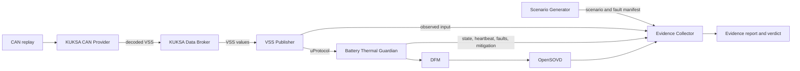

<!--
Copyright (c) 2026 Contributors to the Eclipse Foundation

See the NOTICE file(s) distributed with this work for additional
information regarding copyright ownership.

This program and the accompanying materials are made available under the
terms of the Eclipse Public License 2.0 which is available at
https://www.eclipse.org/legal/epl-2.0

SPDX-License-Identifier: EPL-2.0
-->

# OTA Outlaws Software Architecture

This document follows the 13-part structure from *The Software Architecture
Guidebook* by Simon Brown. Sections with incomplete project information contain
short fill-in patterns; these are prompts, not claims about implemented behavior.

## 1. Context

The Battery Thermal Guardian is part of the OTA Outlaws Safety Evidence Factory.
It evaluates battery temperature data, requests warnings and mitigation, and
produces diagnostic events. The Evidence Collector observes the run and assembles
the evidence and verdict; it is test infrastructure, not part of the vehicle
Guardian.


**External actors and systems:**

| Name | Role |
|---|---|---|
| KUKSA CAN Provider | Converts CAN frames to VSS signals |
| KUKSA Data Broker | Stores decoded VSS values |
| OpenSOVD Server | Makes diagnostic records visible |
| Ankaios | Manage lifetime of container under test |
| Docker Compose | Manage lifetime of container under test |

## 2. Functional Overview

The nominal data path is CAN temperature source -> KUKSA CAN Provider -> KUKSA
Data Broker -> VSS Publisher -> Battery Thermal Guardian -> OpenSOVD Server -> Evidence Collector. The
Guardian publishes thermal state, monitoring status, heartbeat, warning or
mitigation events, and faults. The Evidence Collector observes relevant inputs,
Guardian events, and diagnostics to determine whether each scenario passed.

The Guardian protects: its behavior determines what the vehicle is told. The
Evidence Collector explains and proves: it attributes faults, measures timing,
checks diagnostics, and produces the verdict. The Scenario Generator acts as the
campaign runner by preparing deterministic scenarios and recording a manifest.

| Responsibility | Owner |
|---|---|
| Temperature thresholds, trend, hot spot, and hysteresis | Guardian |
| Freshness, stuck-value, and plausibility response | Guardian |
| Fault reporting to DFM | Guardian |
| Guardian heartbeat publication | Guardian |
| Missing-heartbeat observation and verdict evidence | Evidence Collector/runtime, according to the deployment contract |
| Source/publisher/transport fault attribution | Evidence Collector |
| Sequence-based duplicate, reorder, and drop analysis | Evidence Collector; Guardian applies its defined freshness rules |
| Timing measurements, OpenSOVD checks, and verdict | Evidence Collector |
| Fault scenario execution and manifest | Scenario Generator or documented manual campaign runner |

## 3. Quality Attributes

| Attribute | Architectural concern | Source or verification |
|---|---|---|
| Functional safety | Hazards, operating situations, safety goals, and candidate ratings | [HARA](hara.md); validate S/E/C and ASIL with the vehicle/system safety owner |
| Safety behavior | Thermal state and monitoring status remain distinct; loss or invalidity must not be interpreted as a safe battery | [Safety Concept](../explanation/safety-concept.md); verify each linked FSR |
| Timing | Warning, freshness, reaction, and diagnostic visibility have measurable budgets | Safety Concept parameters; measure with the Evidence Collector |
| Diagnostic observability | Guardian faults can be correlated to DFM and OpenSOVD records | Campaign tests for every relevant fault |
| Reproducibility | Fault campaigns can be rerun with the same inputs and expected reactions | Scenario manifest, configured environment, and repeat-run comparison |
| Portability | Guardian logic depends on the uProtocol service contract, not direct broker or CAN-decoder internals | Architecture/interface review and deployment rerun |

The HARA identifies hazardous events and candidate safety goals; it is not a
quality-attribute specification by itself. Measurable implementation behavior is
defined in the Safety Concept and linked to HARA identifiers there.

## 4. Constraints

- The Guardian receives VSS data through the uProtocol service interface and
  does not read the KUKSA Data Broker directly.
- Fault campaigns must be deterministic, replayable, and configured rather than
  relying on machine-specific paths, hosts, or credentials.
- Every campaign verdict must retain its evidence chain from hazard and safety
  goal through fault, detection, mitigation, diagnostics, and verdict.
- Failed scenarios remain visible in campaign reports.
- The project target includes Ankaios-managed deployment; AutoSD/runtime support
  must be verified in the deployment environment rather than assumed from this
  diagram.
- Clearly label functionality that is mocked, simulated, planned, or incomplete.

## 5. Principles

- Keep Guardian safety reactions independent of the Evidence Collector. The
  collector observes; it does not influence Guardian behavior.
- Keep thermal risk and input monitoring trust as separate output dimensions.
- Fail toward warning when uncertain input could represent a real thermal event;
  do not let invalid input lower thermal caution.
- Attribute faults at the layer where evidence supports attribution. Do not make
  the Guardian diagnose causes that are only visible at other tap points.
- Treat interfaces, parameters, and campaign manifests as explicit contracts.
- Record architecture decisions in the decision log below.

## 6. Software Architecture

### Container view


### Component catalog

| Component | Implementation | Documentation |
|---|---|---|
| Temperature Sensor | C, ThreadX (target/source details TBD) | TODO: link component documentation |
| Scenario Generator | Python | TODO: link campaign-runner documentation |
| VSS Publisher | [vss-publisher](../../vss-publisher) | [Battery Thermal Contract](../../contracts/README.md) |
| Battery Thermal Guardian | [guardian](../../guardian), [guardian-service](../../guardian-service) | [Battery Thermal Guardian](components/battery-thermal-guardian.md) |
| Campaign | Rust | TODO: link collector documentation |
| KUKSA Data Broker | External component | KUKSA documentation/configuration TBD |
| OpenSOVD Server | External component | OpenSOVD/DFM configuration TBD |
| Watchdog | Rust | TBD |

### Component design pattern

For each component, document:

| Field | Description |
|---|---|
| Responsibility | One sentence describing what the component owns |
| Interfaces | Provided and required interfaces, protocol, and schema |
| State and lifecycle | Startup, normal operation, degraded behavior, shutdown |
| Dependencies | Other components and configuration required |
| Failure behavior | Detection, reporting, recovery, and supervision |
| Verification | Unit, integration, and campaign tests |

TODO: Add component diagrams where they improve understanding beyond the
container view.

## 7. Code

| Codebase | Language/runtime | Responsibility | Entry point and build/test instructions |
|---|---|---|---|
| [vss-publisher](../../vss-publisher) | Rust | Exposes VSS data through the service contract | See repository README/Cargo targets; document exact command here |
| [guardian](../../guardian) | Rust | Evaluates Guardian state and safety behavior | TODO: document entry point and commands |
| [guardian-service](../../guardian-service) | Rust | Connects Guardian behavior to its runtime interface | TODO: document entry point and commands |
| Evidence Collector | Python | Correlates campaign evidence | TODO: identify code location and commands |
| Scenario Generator | Python | Prepares deterministic fault campaigns | TODO: identify code location and commands |

**Code organization pattern:**

- Package/module: `TODO`
- Public interface: `TODO`
- Configuration and parameter loading: `TODO`
- Error handling and diagnostics: `TODO`
- Unit/integration test locations: `TODO`

## 8. Data

### Data flow



### CAN signal contract

Message `BMS_MSG1`, CAN ID `0x500`, DLC 8 bytes, cycle time 100 ms, sent by the
BMS. Byte order is little endian. Temperatures are raw degrees Celsius, factor
1, offset 0.

| Field | Bytes | Bits | Type | Range | Unit |
|---|---|---|---|---|---|
| CellTempMax | 0-1 | 0-15 | `uint16` | 0...255 | °C |
| CellTempMin | 2-3 | 16-31 | `uint16` | 0...255 | °C |
| CellTempAvg | 4-5 | 32-47 | `uint16` | 0...255 | °C |
| Quality | 6 | 48-55 | `uint8` | See quality enum | - |
| AliveCounter | 7 | 56-63 | `uint8` | 0...255 | - |

`AliveCounter` increments on every transmitted frame and wraps at 255. A counter
that stops advancing marks the data as stale even while the last value looks
plausible. The authoritative signal definition is [can/BMS_MSG1_CAN.dbc](../../can/BMS_MSG1_CAN.dbc);
[can/BMS_MSG1_CAN.asc](../../can/BMS_MSG1_CAN.asc) is a sample trace.

### Quality enum

```text
INVALID             = 0x00
VALID               = 0x80
ERROR_NOT_AVAILABLE = 0xFF
```

### VSS mapping

The KUKSA CAN Provider maps these signals as defined in
[can/vss_dbc.json](../../can/vss_dbc.json):

| CAN signal | VSS path | Type |
|---|---|---|
| CellTempMax | `Vehicle.Powertrain.TractionBattery.Temperature.Max` | `float` |
| CellTempMin | `Vehicle.Powertrain.TractionBattery.Temperature.Min` | `float` |
| CellTempAvg | `Vehicle.Powertrain.TractionBattery.Temperature.Average` | `float` |
| Quality | `Vehicle.Powertrain.TractionBattery.BMS.SignalQuality` | `uint8` |
| AliveCounter | `Vehicle.Powertrain.TractionBattery.BMS.AliveCounter` | `uint8` |

The temperature paths are standard VSS. The `BMS` branch is a project-private
extension, not part of the VSS standard catalogue.

### Scenario manifest pattern

| Field | Purpose | Status |
|---|---|---|
| `run_id` | Identifies one campaign run | Required; schema TBD |
| `scenario_id` | Identifies the scenario and expected reactions | Required; schema TBD |
| `seed` | Makes generated input/fault selection repeatable | Required when generation is randomized |
| `correlation_id` | Links injected fault, Guardian event, diagnostics, and verdict | Required |
| `faults` | Fault kind, target, parameters, and activation condition | Required; schema TBD |
| `expected_reactions` | Expected states/events and timing budgets | Required; schema TBD |
| `environment` | Relevant software versions and configuration | Required fields TBD |

TODO: Define the machine-readable schema and versioning/compatibility rules.

## 9. Infrastructure Architecture

| Infrastructure element | Purpose | Current details or open point |
|---|---|---|
| MXCHIP device | Temperature source target | ThreadX firmware and sensor interface details TBD |
| HPC | Hosts data services, Guardian, campaign and evidence workloads | Hardware and OS profile TBD |
| CAN replay and KUKSA CAN Provider | Supplies decoded VSS input | Replay/provider deployment and versions TBD |
| KUKSA Data Broker | Stores VSS values | Endpoint and configuration are environment-specific |
| OpenSOVD and DFM | Stores/exposes fault records | Deployment and transport details TBD |
| Network | Connects distributed services | Ports, trust boundaries, and security controls TBD |

TODO: Add an infrastructure diagram showing nodes, networks, trust boundaries,
and external services when the target environment is finalized.

## 10. Deployment

| Target | Component |
|---|---|
| MXCHIP | Temperature Sensor |
| HPC | Scenario Generator |
| HPC | KUKSA Data Broker |
| HPC | VSS Publisher |
| HPC | Battery Thermal Guardian |
| HPC | OpenSOVD Server |
| HPC | Evidence Collector |

Ankaios is the intended workload orchestrator. The exact workload manifests,
restart policies, resource limits, and AutoSD deployment status must be recorded
with the runnable deployment configuration.

TODO: Add a deployment view mapping containers in section 6 to runtime nodes,
including replicas, configuration, and external dependencies.

## 11. Operation and Support

| Operational concern | Current approach | Open item |
|---|---|---|
| Guardian health | Guardian publishes a heartbeat | Confirm monitor, timeout, and restart ownership in deployment |
| Monitoring degradation | Guardian publishes monitoring status and a fault | Link operator/vehicle response to the approved safety concept |
| Diagnostics | Guardian writes DFM records; OpenSOVD exposes them | Confirm record schema, retention, and failure behavior |
| Campaign execution | Scenario Generator or documented manual runner | Document repeatable start/stop and cleanup steps |
| Evidence and failed runs | Evidence Collector creates a verdict report; failures remain visible | Define report retention and artifact locations |
| Recovery | Per-scenario Guardian restart is planned/used by campaign assumptions | Document runtime recovery behavior for deployed operation |

**Runbook pattern:**

- Start condition: `TODO`
- Health checks: `TODO`
- Expected logs/diagnostics: `TODO`
- Recovery/escalation: `TODO`
- Stop and cleanup: `TODO`

## 12. Development Environment

| Area | Pattern to complete |
|---|---|
| Host prerequisites | OS, toolchains, container runtime, and hardware access: `TODO` |
| Build | Per-component build commands and required environment: `TODO` |
| Tests | Unit, integration, and campaign commands: `TODO` |
| Local services | Broker, publisher, Guardian, DFM/OpenSOVD setup: `TODO` |
| Configuration | Example config, parameter source, and secret handling: `TODO` |
| CI | Workflows, required checks, and artifact publication: `TODO` |
| Reproduction | Clean-checkout procedure and expected baseline result: `TODO` |

## 13. Decision Log

Record decisions that materially affect interfaces, deployment, safety behavior,
or quality attributes. Link each decision to relevant requirements and code.

| ID | Date | Status | Context | Decision | Consequences | Owner |
|---|---|---|---|---|---|---|
| `ADR-XXX` | `YYYY-MM-DD` | Proposed/Accepted/Deprecated | `Problem and forces` | `Chosen option and rationale` | `Trade-offs and follow-up` | `Name/team` |

The scenario catalog and the run manifest are described in the
[Campaign Tool](components/campaign.md#scenario-catalog).

## AI Assistance

The original C4 diagrams and component overview were created with the assistance
of **Claude Code** using the model **Claude Opus 5.5**
(`claude-opus-5-5`).

The CAN signal and VSS mapping material was updated with the assistance of
**Claude Code** using the model **Claude Opus 5** (`claude-opus-5`).

This document was reorganized with the assistance of **GitHub Copilot** using
the model **GPT-6 Luna**.
