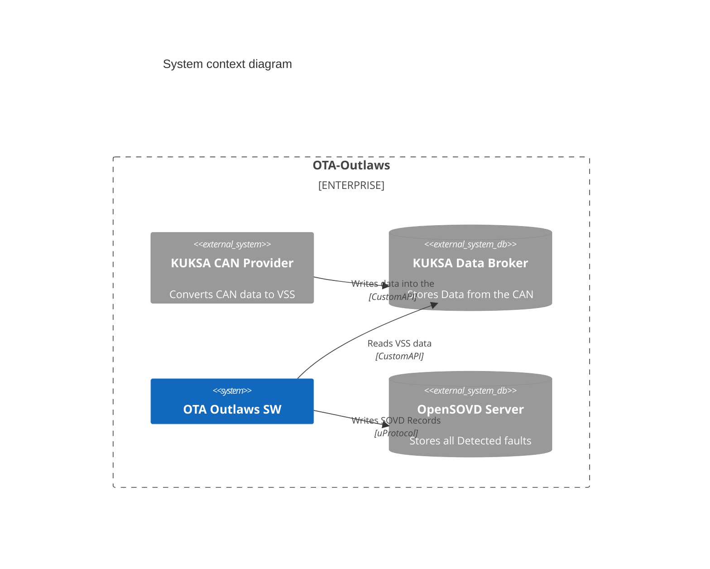

# High Level Overview


# Components View

|Component Name|Code|Documentation|
|---|---|---|
|Temperature Sensor|||
|Scenario Generator|||
|KUKSA Proxy|||
|Battery Thermal Guardian|||
|Evidence Collector|||
|KUKSA Data Broker|||
|OpenSOVD Server|||


# Data Flow

```mermaid
flowchart LR
    SG["Scenario Generator<br/>Python, seed"]
    ASC[".asc + .dbc<br/>faults live in the .asc"]
    CAN["KUKSA CAN Provider<br/>DBC decode → VSS"]
    DB["KUKSA Data Broker<br/>VSS signal store"]
    BR["vss-bridge<br/>VSS → uProtocol"]
    MAN["Scenario manifest<br/>injection time, correlation_id"]
    COL["Evidence Collector<br/>collects, correlates"]
    GUARD["Battery Thermal Guardian<br/>states, plausibility"]
    REP["Verdict + report<br/>JSON + Markdown/HTML"]
    SOVD["OpenSOVD Server<br/>faults over HTTP"]
    DFM["DFM (fault-lib)<br/>fault storage"]

    SG -->|writes| ASC
    SG -->|inflicts fault| BR
    ASC -->|replay| CAN
    CAN -->|gRPC| DB
    DB -->|gRPC| BR
    BR -->|uProtocol| GUARD
    MAN --> COL
    GUARD -->|heartbeat/fault/mitigation| COL
    GUARD --> DFM
    DFM --> SOVD
    SOVD --> COL
    COL --> REP
```



# Deployment

|Deployment Target|Component Name|
|---|---|
|MXCHIP|Temperature Sensor|
|HPC|Scenario Generator|
|HPC|KUKSA Data Broker|
|HPC|KUKSA Proxy|
|HPC|Battery Thermal Guardian|
|HPC|OpenSOVD Server|
|HPC|Evidence Collector|

# Misc

## Can Signals

| Field Name | Bits | Datatype | Range | Unit |
|---|---|---|---|---|
| CellTempMax | 0-7 | `uint8` | 0...255 | °C |
| CellTempMin | 8-15 | `uint8` | 0...255 | °C |
| CellTempAvg | 16-23 | `uint8` | 0...255 | °C |
| Quality | 24-25 | `enum` | 0...2 | – |
| Counter | 26-34 | `uint8` | 0...255 | – |


## Quality Enum
```
UNDEFINED = 0
OK = 1
INVALID = 2
```
## Manifest Structure
