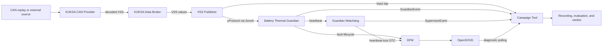

<!--
Copyright (c) 2026 Contributors to the Eclipse Foundation

See the NOTICE file(s) distributed with this work for additional
information regarding copyright ownership.

This program and the accompanying materials are made available under the
terms of the Eclipse Public License 2.0 which is available at
https://www.eclipse.org/legal/epl-2.0

SPDX-License-Identifier: EPL-2.0
-->

# 0. Intro

This document follows the 13-part structure from *The Software Architecture
Guidebook* by Simon Brown. Sections with incomplete project information contain
short fill-in patterns; these are prompts, not claims about implemented behavior.

# 1. Context

The Battery Thermal Guardian is part of the OTA Outlaws Safety Evidence Factory.
It evaluates battery temperature data and publishes warning/mitigation requests
and diagnostic events; those requests do not prove that an occupant interface or
actuator acted on them. The Evidence Collector observes the run and assembles the
evidence and verdict; it is test infrastructure, not part of the vehicle
Guardian.


**External actors and systems:**

| Name | Role |
|---|---|
| KUKSA CAN Provider | Converts CAN frames to VSS signals |
| KUKSA Data Broker | Stores decoded VSS values |
| DFM and OpenSOVD gateway | Store and expose diagnostic records |
| Docker Compose | Runs the local signal chain and isolated campaign projects |
| Ankaios | Intended target runtime; no deployment manifest is currently present |

# 2. Functional Overview

The nominal data path is CAN trace or external sensor -> KUKSA CAN Provider ->
KUKSA Data Broker -> VSS Publisher -> Battery Thermal Guardian over uProtocol.
The Guardian publishes thermal and monitoring events, mitigation requests,
fault events, and a heartbeat over uProtocol. Guardian and watchdog fault
lifecycle records are sent to DFM; the OpenSOVD gateway exposes them to the
campaign tool. The campaign tool is a Rust crate that runs scenarios, records
uProtocol and OpenSOVD observations, evaluates evidence, and writes verdicts.
Python is used by trace-generation scripts and the optional AZ3166 UDP bridge;
scenario execution and evidence collection are handled by the Rust campaign tool.

| Responsibility | Owner |
|---|---|
| Temperature thresholds, trend, and hysteresis | Guardian; hot-spot criterion is not implemented |
| Freshness, stuck-value, and plausibility response | Guardian |
| Guardian fault reporting to DFM | Guardian service through the local DFM reporter interface |
| Guardian heartbeat publication | Guardian service, every 500 ms |
| Heartbeat-loss detection and reporting | Separate Rust watchdog publishes a monitoring-unavailable `SupervisorEvent` and reports a DTC; it does not restart a hung Guardian |
| Input/event taps, OpenSOVD polling, timing evaluation, and verdict | Rust campaign tool; attribution is limited to the evidence available at its tap points |
| Fault scenario execution and manifest | Rust campaign tool using `campaign/scenarios.toml`; TS-27 is the catalogued source-loss/diagnostics-outage scenario |

# 3. Quality Attributes

| Attribute | Architectural concern | Source or verification |
|---|---|---|
| Functional safety | Hazards, operating situations, safety goals, and candidate ratings | [HARA risk classification and safety goals](hara.md#risk-classification-and-safety-goals); S/E/C and ASIL remain subject to vehicle/system safety-owner confirmation |
| Safety behavior | Thermal state and monitoring status remain distinct; loss or invalidity must not be interpreted as a safe battery | [HARA-derived requirements](hara.md#derived-functional-requirements) and their current tests in [HARA-derived test scenarios](hara.md#hara-derived-test-scenarios) |
| Timing | Warning, freshness, reaction, and diagnostic visibility have measurable budgets | HARA DFR-1 and test-case budgets; implementation values are in `config/guardian/safety-params.toml` and `campaign/scenarios.toml` |
| Diagnostic observability | Guardian faults can be correlated to DFM and OpenSOVD records | Integration and campaign tests cover selected fault paths; coverage remains incomplete |
| Reproducibility | Fault campaigns can be rerun with the same inputs and expected reactions | Scenario manifest, configured environment, and repeat-run comparison |
| Portability | Guardian logic depends on the uProtocol service contract, not direct broker or CAN-decoder internals | Architecture/interface review and deployment rerun |

The HARA is the safety reference in this repository. It records candidate
hazards and safety goals, derived requirements, and test scenarios. Runtime
parameter values are configured in `config/guardian/safety-params.toml`; the
campaign catalog supplies additional budgets and maps scenarios to HARA tests.
The HARA still contains candidate, unconfirmed risk ratings and requirements
that are not implemented, so those must not be presented as verified behavior.

# 4. Constraints

- The Guardian receives VSS data through the uProtocol service interface and
  does not read the KUKSA Data Broker directly.
- Fault campaigns must be deterministic, replayable, and configured rather than
  relying on machine-specific paths, hosts, or credentials.
- Every campaign verdict must retain its evidence chain from hazard and safety
  goal through fault, detection, mitigation, diagnostics, and verdict.
- Failed scenarios remain visible in campaign reports.
- The project target includes Ankaios-managed deployment; AutoSD/runtime support
  must be verified in the deployment environment rather than assumed from this
  diagram.
- Clearly label functionality that is mocked, simulated, planned, or incomplete.

# 5. Principles

- Keep Guardian safety reactions independent of the Evidence Collector. The
  collector observes; it does not influence Guardian behavior.
- Keep thermal risk and input monitoring trust as separate output dimensions.
- Fail toward warning when uncertain input could represent a real thermal event;
  do not let invalid input lower thermal caution.
- Attribute faults at the layer where evidence supports attribution. Do not make
  the Guardian diagnose causes that are only visible at other tap points.
- Treat interfaces, parameters, and campaign manifests as explicit contracts.
- Record architecture decisions in the decision log below.

# 6. Software Architecture

## Container view


The AZ3166 UDP bridge is a manual campaign-control/demo path: a Windows
PowerShell relay forwards UDP to the WSL2 Python bridge, which starts the Rust
campaign and relays verdicts to the board. Board sensor samples are not inputs
to `campaign run`; scenarios use catalogued CAN traces through KUKSA. See the
[AZ3166 communication flow](../../MXChip_Sensor_ECU/AZ3166/COMMUNICATION_FLOW.md).
The Dashboard is omitted from this flow view; it is a local Compose service
that controls Docker and can launch the campaign runner.

## Component catalog

The following subchapters describe each component using the same responsibility,
interface, lifecycle, dependencies, failure behavior, and verification fields.

## Component design pattern

For each component, document:

| Field | Description |
|---|---|
| Responsibility | One sentence describing what the component owns |
| Interfaces | Provided and required interfaces, protocols, and schemas |
| State and lifecycle | Startup, normal operation, degraded behavior, and shutdown |
| Dependencies | Other components and configuration required |
| Failure behavior | Detection, reporting, recovery, and supervision |
| Verification | Unit, integration, and campaign tests |

### CAN trace and AZ3166 demo source

| Field | Description |
|---|---|
| Responsibility | Provide replayable CAN stimulus from checked-in traces. The AZ3166 is a separate manual demo/control source; its sensor readings do not feed campaign runs. |
| Interfaces | ASC trace to the KUKSA CAN Provider; AZ3166 sensor/button UDP to the WSL2 campaign bridge through the Windows relay. |
| State and lifecycle | Campaign traces play once per run; the development Compose trace loops. The board sends telemetry and waits for campaign results. |
| Dependencies | Traces, provider, and Docker Compose; the hardware demo additionally needs the AZ3166, Wi-Fi, Windows relay, WSL2, and Python bridge. |
| Failure behavior | Missing trace fails campaign setup; absent CAN frames cause Guardian freshness handling. Loss of the board UDP path interrupts only the manual demo exchange. |
| Verification | [Campaign traces](../../campaign/traces/README.md), [signal-chain guide](../how-to/run-signal-chain.md), and [AZ3166 communication flow](../../MXChip_Sensor_ECU/AZ3166/COMMUNICATION_FLOW.md). |

### KUKSA CAN Provider

| Field | Description |
|---|---|
| Responsibility | Decode CAN frames into mapped VSS signals. |
| Interfaces | Reads CAN/ASC frames using [`BMS_MSG1_CAN.dbc`](../../can/BMS_MSG1_CAN.dbc) and [`vss_dbc.json`](../../can/vss_dbc.json); publishes signal updates to the Data Broker over gRPC. |
| State and lifecycle | External Compose image; development replay loops, while the campaign project replays its selected trace once. |
| Dependencies | Data Broker, DBC, VSS mapping, and trace or configured CAN source. |
| Failure behavior | Provider/source loss stops updates; the Guardian eventually reports freshness loss. |
| Verification | [Signal-chain guide](../how-to/run-signal-chain.md) and end-to-end [campaign scenarios](../../campaign/scenarios.toml). |

### KUKSA Data Broker

| Field | Description |
|---|---|
| Responsibility | Store decoded VSS values and serve them to subscribers. |
| Interfaces | Accepts provider updates and serves VSS subscriptions over gRPC to the VSS Publisher and dashboard tap. |
| State and lifecycle | External Compose service populated with the project VSS tree; Compose restarts it unless stopped. |
| Dependencies | VSS tree/mapping in `can/vss_dbc.json`, KUKSA CAN Provider, and subscriber connections. |
| Failure behavior | Missing/stale values prevent new publisher messages; Guardian freshness logic reports loss instead of treating cached data as current. |
| Verification | [Signal-chain guide](../how-to/run-signal-chain.md) and campaign observations at the Guardian input. |

### VSS Publisher

| Field | Description |
|---|---|
| Responsibility | Assemble the battery VSS values and publish the Guardian's `BatteryTemperature` contract. |
| Interfaces | Subscribes to Data Broker gRPC; publishes Protobuf over uProtocol/Zenoh at `//battery-vss/9001/1/9001`. |
| State and lifecycle | Rust Compose service; waits until all five signals are known and publishes when the alive-counter update completes a frame. |
| Dependencies | Data Broker, configured signal paths, and Zenoh endpoints. |
| Failure behavior | A failed subscription or incomplete frame prevents publication; Guardian freshness monitoring detects missing input. |
| Verification | `cargo test -p vss-publisher`, [Battery Thermal Contract](../../contracts/README.md), and [signal-chain guide](../how-to/run-signal-chain.md). |

### Battery Thermal Guardian

| Field | Description |
|---|---|
| Responsibility | Evaluate temperature risk and input trust; publish thermal, monitoring, fault, mitigation-request, and heartbeat events. |
| Interfaces | `guardian-service` consumes `BatteryTemperature` and publishes `GuardianEvent`/`Heartbeat` over uProtocol/Zenoh; DTC lifecycle is reported to DFM over local IPC. |
| State and lifecycle | Deterministic Rust core receives samples and 50 ms ticks; service loads `config/guardian/safety-params.toml` and runs in Compose. |
| Dependencies | uProtocol contract, Zenoh, safety parameters, and DFM for diagnostics. |
| Failure behavior | Invalid or missing input raises defined monitoring faults. Docker restarts a crashed process; the watchdog detects hangs. Diagnostic unavailability does not gate core evaluation. |
| Verification | [Guardian requirement tests](../../guardian/tests/requirements.rs), [diagnostics tests](../../guardian-service/tests/diagnostics.rs), and Rust campaign scenarios. |

### Rust Campaign Tool

| Field | Description |
|---|---|
| Responsibility | Run catalogued stimuli, record system observations, evaluate evidence, and report verdicts. |
| Interfaces | `run`, `observe`, and `evaluate` CLI commands; passive uProtocol taps for Guardian input/events and supervisor events; read-only OpenSOVD HTTP polling. |
| State and lifecycle | `run` creates a fresh Compose project per scenario, writes a manifest and JSONL recording, tails diagnostics, emits reports, and removes the project. `observe` taps an existing stack. |
| Dependencies | Docker Compose, `campaign/scenarios.toml`, Guardian parameters, traces, diagnostics image, and repository root. |
| Failure behavior | Preserves logs/errors and judges missing evidence INCONCLUSIVE; failed expected checks produce FAIL, and scenarios remain in reports. |
| Verification | `cargo test -p campaign` and `cargo run -p campaign -- run --all`; see [Campaign Tool](components/campaign.md). |

### Diagnostic Fault Manager (DFM)

| Field | Description |
|---|---|
| Responsibility | Store DTC lifecycle records reported by the Guardian and watchdog. |
| Interfaces | `fault_lib` reporters over local iceoryx2 IPC; serves records to the OpenSOVD gateway. |
| State and lifecycle | External diagnostics-image container loads `diagnostics/catalog/battery_guardian.json` and initializes DTCs as NotTested. |
| Dependencies | Diagnostics image, DTC catalog, shared IPC/PID namespaces, and `dfm-storage` volume. |
| Failure behavior | Guardian evaluation continues if DFM is unavailable; reporter delivery is asynchronous and best-effort. Persistence across abrupt DFM restart is not established. |
| Verification | Guardian diagnostics integration tests, TS-27, and [diagnostics setup](../../README.md#interfaces-and-ipc). |

### OpenSOVD Gateway

| Field | Description |
|---|---|
| Responsibility | Expose DFM DTC records through the SOVD HTTP API. |
| Interfaces | Reads DFM over shared IPC; serves fault-list and per-DTC HTTP endpoints to the campaign tool and dashboard. |
| State and lifecycle | External diagnostics-image container with a Compose health check; host port is bound to localhost by default. |
| Dependencies | DFM process/IPC namespace, diagnostics image, catalog entity, and configured SOVD port. |
| Failure behavior | Diagnostic visibility becomes unavailable; Guardian evaluation and mitigation requests continue, while campaign evidence checks fail or become inconclusive. |
| Verification | Campaign OpenSOVD checks, TS-27, and [signal-chain guide](../how-to/run-signal-chain.md). |

### Guardian Watchdog

| Field | Description |
|---|---|
| Responsibility | Detect Guardian heartbeat loss, publish the independent monitoring-unavailable request, and report a DTC. |
| Interfaces | Subscribes to `Heartbeat`; publishes `SupervisorEvent` over uProtocol/Zenoh; reports `BTG_GuardianHeartbeatLoss` to DFM over local IPC. |
| State and lifecycle | Rust service checks every 100 ms with a default 1500 ms timeout; campaigns start it after Guardian readiness when requested. |
| Dependencies | Zenoh, heartbeat/supervisor contract, DFM IPC/catalog, and `HEARTBEAT_TIMEOUT_MS`. |
| Failure behavior | Reports heartbeat loss once per outage and publishes restoration on recovery. Compose restarts a crashed watchdog; a hung Guardian is detected but not restarted. |
| Verification | Watchdog unit tests and catalogued TS-22/TS-23 campaigns; see [Guardian Watchdog](components/guardian-watchdog.md). |

### Dashboard

| Field | Description |
|---|---|
| Responsibility | Observe and operate the local Compose stack, show diagnostics/evidence, and launch campaigns; it is not part of the safety function. |
| Interfaces | Browser HTTP UI; Docker Engine API over the socket; passive KUKSA/uProtocol/OpenSOVD taps; separate campaign-runner container. |
| State and lifecycle | Rust Compose service bound to localhost; repository mount is read-only, while campaign runs use a separate container. |
| Dependencies | Docker socket, Compose project, Zenoh, Data Broker, OpenSOVD, campaign image, and repository paths. |
| Failure behavior | Dashboard failure affects its UI/control workflow only; Guardian and watchdog run independently. Docker socket access grants broad host control. |
| Verification | `cargo test -p dashboard`; see [Dashboard](components/dashboard.md). |

# 7. Code

| Codebase | Language/runtime | Responsibility | Entry point and build/test instructions |
|---|---|---|---|
| [vss-publisher](../../vss-publisher) | Rust | Subscribes to KUKSA VSS data and publishes `BatteryTemperature` over uProtocol | `cargo run -p vss-publisher`; see [contract](../../contracts/README.md) |
| [guardian](../../guardian) and [guardian-service](../../guardian-service) | Rust | Evaluate samples, publish Guardian events/heartbeat, and report DTC lifecycle updates | `cargo test -p guardian -p guardian-service`; service entry point: `guardian-service/src/main.rs` |
| [campaign](../../campaign) | Rust | Runs catalog scenarios, records evidence, evaluates runs, and writes reports | `cargo run -p campaign -- run --all`; [commands and artifacts](components/campaign.md) |
| [watchdog](../../watchdog) | Rust | Monitors Guardian heartbeat and reports heartbeat loss to DFM | `cargo test -p watchdog`; service entry point: `watchdog/src/main.rs` |
| [dashboard](../../dashboard) | Rust | Inspects and controls the local Compose stack and launches campaign runs | `cargo test -p dashboard`; [Dashboard](components/dashboard.md) |

The checked-in [workspace SBOM](../../sbom.cdx.json) is a single CycloneDX 1.6
document covering all eight Cargo workspace members and their resolved
dependencies. Regenerate it from the repository root after changing a Cargo
manifest or `Cargo.lock` with `cargo install cargo-sbom --version 0.10.0 --locked`
followed by `cargo sbom --output-format cyclone_dx_json_1_6 > sbom.cdx.json`.

**Code organization pattern:**

- Package/module: Rust workspace crates, listed in the Code table above
- Public interface: Protobuf schema in [`contracts/battery_thermal.proto`](../../contracts/battery_thermal.proto)
- Configuration and parameter loading: [`config/guardian/safety-params.toml`](../../config/guardian/safety-params.toml), Compose environment, and [`campaign/scenarios.toml`](../../campaign/scenarios.toml)
- Error handling and diagnostics: Guardian/watchdog events over uProtocol; DFM records exposed by OpenSOVD
- Unit/integration test locations: crate `tests/` directories; see [Run the Tests](../how-to/run-tests.md)

# 8. Data

## Data flow



## CAN signal contract

Message `BMS_MSG1`, CAN ID `0x500`, DLC 8 bytes, cycle time 100 ms, sent by the
BMS. Byte order is little endian. Temperatures are raw degrees Celsius, factor
1, offset 0.

| Field | Bytes | Bits | Type | Range | Unit |
|---|---|---|---|---|---|
| CellTempMax | 0-1 | 0-15 | `uint16` | 0...255 | °C |
| CellTempMin | 2-3 | 16-31 | `uint16` | 0...255 | °C |
| CellTempAvg | 4-5 | 32-47 | `uint16` | 0...255 | °C |
| Quality | 6 | 48-55 | `uint8` | See quality enum | - |
| AliveCounter | 7 | 56-63 | `uint8` | 0...255 | - |

`AliveCounter` increments on every transmitted frame and wraps at 255. A counter
that stops advancing marks the data as stale even while the last value looks
plausible. The authoritative signal definition is [can/BMS_MSG1_CAN.dbc](../../can/BMS_MSG1_CAN.dbc);
[can/BMS_MSG1_CAN.asc](../../can/BMS_MSG1_CAN.asc) is a sample trace.

## Quality enum

```text
INVALID             = 0x00
VALID               = 0x80
ERROR_NOT_AVAILABLE = 0xFF
```

## VSS mapping

The KUKSA CAN Provider maps these signals as defined in
[can/vss_dbc.json](../../can/vss_dbc.json):

| CAN signal | VSS path | Type |
|---|---|---|
| CellTempMax | `Vehicle.Powertrain.TractionBattery.Temperature.Max` | `float` |
| CellTempMin | `Vehicle.Powertrain.TractionBattery.Temperature.Min` | `float` |
| CellTempAvg | `Vehicle.Powertrain.TractionBattery.Temperature.Average` | `float` |
| Quality | `Vehicle.Powertrain.TractionBattery.BMS.SignalQuality` | `uint8` |
| AliveCounter | `Vehicle.Powertrain.TractionBattery.BMS.AliveCounter` | `uint8` |

The temperature paths are standard VSS. The `BMS` branch is a project-private
extension, not part of the VSS standard catalogue.

## Campaign manifest and evidence identifiers

| Field | Purpose | Status |
|---|---|---|
| `run_id` | Identifies a campaign or observed run | Written by the Rust campaign tool |
| `scenario` | Selects the catalog scenario | Written by the Rust campaign tool; scenario definition and expectations are in `campaign/scenarios.toml` |
| `mode` | `run` for tool-driven stimulus or `observe` for external stimulus | Written by the Rust campaign tool |
| `started_at`, `git_revision` | Run start and repository revision | Written when available |
| `stimulus` | Serialized stimulus configuration | Written by the Rust campaign tool |
| `inputs` | SHA-256 hashes of the catalog, safety parameter file, and trace when applicable | Written by the Rust campaign tool |

The campaign report adds the HARA hazard/safety-goal references and evaluation.
There is no single `correlation_id` field: evidence is related through the run
and scenario, Guardian `session_id`, `event_id` and `cause_event_id`, and the
session/event metadata in DFM/OpenSOVD records. Scenario expectations are stored
in the TOML catalog, not duplicated in the manifest. [HARA TS-27](hara.md#ts-27-source-loss-during-dfmopensovd-outage)
is the implemented `source_loss_during_diagnostics_outage` entry in
[`campaign/scenarios.toml`](../../campaign/scenarios.toml).

# 9. Infrastructure Architecture

| Infrastructure element | Purpose | Current details or open point |
|---|---|---|
| Developer host with Docker Compose | Runs the demonstrated signal chain, diagnostics, dashboard, and campaign projects | Configuration is in `docker-compose.yml`; environment-specific host ports can be overridden |
| CAN trace replay / optional MXChip source | Supplies temperature frames | Automated scenarios replay checked-in ASC traces; the board is an external/manual source |
| Zenoh, KUKSA CAN Provider, and Data Broker | Route uProtocol and decode/store VSS data | Container services in `docker-compose.yml`; Guardian receives data only through the uProtocol contract |
| Guardian and Watchdog | Evaluate temperature data and supervise Guardian heartbeat | Separate Rust containers; DFM IPC and Zenoh transport are configured in Compose |
| DFM and OpenSOVD gateway | Store and expose diagnostic records | External image and local IPC; Compose ports/configuration are environment-specific |
| Network and Docker socket | Connect services; dashboard controls Docker | Trust boundaries, production credentials, and hardened deployment controls remain unspecified |
| HPC / AutoSD | Intended deployment target | Hardware/OS profile and runnable target deployment are not yet represented by checked-in manifests |

The current trust boundary is the local developer host: the dashboard is bound
to localhost but receives the Docker socket, which grants broad host control.
KUKSA and diagnostic ports are environment-configurable; production network
segmentation, credentials, and a target-HPC trust boundary are not specified.

# 10. Deployment

| Target | Component |
|---|---|
| Developer host (Docker Compose) | Zenoh router, KUKSA CAN Provider, KUKSA Data Broker, VSS Publisher, Battery Thermal Guardian, Guardian Watchdog, DFM, OpenSOVD gateway, and dashboard |
| Developer host (campaign project) | Rust campaign runner and evidence recorder; starts an isolated Compose project per catalog scenario |
| MXChip device (optional/manual) | External ThreadX temperature source for the `campaign observe` demonstration |
| HPC (AutoSD with Ankaios; target) | Intended deployment for vehicle-side services; no checked-in Ankaios/AutoSD deployment manifests or verified target run |

The local Docker Compose deployment is the implemented runtime. Docker restarts
a crashed Guardian according to its Compose policy; a hung Guardian is observed
by the separate watchdog but is not restarted. Campaign execution uses separate
Compose projects rather than Ankaios. Resource limits, production trust
boundaries, and the target deployment remain open.

# 11. Operation and Support

| Operational concern | Current approach | Open item |
|---|---|---|
| Guardian health | Guardian publishes a heartbeat every 500 ms; watchdog reports loss after the configured 1500 ms timeout | Watchdog publishes a monitoring-unavailable `SupervisorEvent` and reports a DTC; it does not restart a hung Guardian. The event does not prove an HMI displayed the warning; see [HARA DFR-5](hara.md#derived-functional-requirements) |
| Monitoring degradation | Guardian publishes monitoring status and a `DRIVER_WARNING_MONITORING_UNAVAILABLE` request | This is an event/request, not proof of a physical warning; see [HARA SG-2](hara.md#risk-classification-and-safety-goals) and [DFR-2](hara.md#derived-functional-requirements) |
| Diagnostics | Guardian and watchdog report lifecycle records to DFM; OpenSOVD exposes them | Campaign tool polls visibility; delivery is asynchronous; see [Campaign Tool](components/campaign.md#evidence-collector-to-opensovd) |
| Campaign execution | Rust campaign tool runs catalog scenarios including TS-27 | See [Campaign Tool](components/campaign.md) and [run tests](../how-to/run-tests.md) |
| Evidence and failed runs | Campaign reports preserve PASS, FAIL, and INCONCLUSIVE results and logs | Output locations and retention are described in [Campaign Tool](components/campaign.md#a-run) |
| Recovery | Guardian recovers on valid input; Docker restarts a crashed process; watchdog detects a hang | No hung-process restart or HMI display is implemented |

**Runbook:** Start with `docker compose up --build -d`; check service state with
`docker compose ps`, OpenSOVD with
`curl -fsS http://127.0.0.1:7690/sovd/v1/apps/battery_guardian/faults`, and
the dashboard at `http://localhost:8080`. Follow [Run the Signal Chain](../how-to/run-signal-chain.md)
for nominal operation and [Run the Tests](../how-to/run-tests.md) for campaign
commands. Inspect failures with `docker compose logs guardian watchdog
opensovd-dfm opensovd-gateway`. Docker restarts a crashed Guardian under the
Compose policy; the watchdog detects but does not restart a hang. Stop the
development stack with `docker compose down`; campaign evidence remains under
`runs/`. DFM persistence across abrupt restart is not established (see the
[diagnostics lifecycle notes](../../README.md#lifecycle)).

# 12. Development Environment

| Area | Pattern to complete |
|---|---|
| Host prerequisites | Stable Rust; Python 3 for trace generation and the optional AZ3166 bridge; Docker Compose for container campaigns | [Run the Tests](../how-to/run-tests.md) |
| Build | `cargo build --workspace`; Compose builds local service images; diagnostics image setup is documented separately | [README build instructions](../../README.md#pull-the-published-diagnostics-image) |
| Tests | `cargo test`, formatting/lint, and Rust campaigns from `campaign/scenarios.toml` | [Run the Tests](../how-to/run-tests.md) |
| Local services | `docker compose up --build -d`; CAN replay, KUKSA, Zenoh, Guardian, watchdog, DFM/OpenSOVD, and dashboard | [Run the Signal Chain](../how-to/run-signal-chain.md) |
| Configuration | Guardian thresholds/timeouts in `config/guardian/safety-params.toml`; service endpoints and ports in Compose/environment; diagnostics image pin in `diagnostics/image.env` | [Compose file](../../docker-compose.yml); [image config](../../diagnostics/image.env) |
| CI | GitHub Actions build, test, lint, and image workflows | [Guardian workflow](../../.github/workflows/guardian.yml); [diagnostics image workflow](../../.github/workflows/diagnostics-image.yml) |
| Reproduction | Clean checkout, pinned diagnostics image, and expected baseline behavior | [README build instructions](../../README.md#build-from-clean-committed-source-optional); [Run the Signal Chain](../how-to/run-signal-chain.md) |

# 13. Decision Log

Record decisions that materially affect interfaces, deployment, safety behavior,
or quality attributes. Link each decision to relevant requirements and code.

| ID | Date | Status | Context | Decision | Consequences | Owner |
|---|---|---|---|---|---|---|
| — | No architecture decisions are recorded in this log yet. |

The scenario catalog and the run manifest are described in the
[Campaign Tool](components/campaign.md#scenario-catalog).

# AI Assistance

The original C4 diagrams and component overview were created with the assistance
of **Claude Code** using the model **Claude Opus 5.5**
(`claude-opus-5-5`).

The CAN signal and VSS mapping material was updated with the assistance of
**Claude Code** using the model **Claude Opus 5** (`claude-opus-5`).

This document was reorganized with the assistance of **GitHub Copilot** using
the model **GPT-6 Luna**.

The implementation alignment, campaign/evidence description, and deployment
view were updated with the assistance of **GitHub Copilot** using the model
**GPT-6 Luna**.

The Draw.io container view, watchdog and TS-27 alignment, and repository
validation details were updated with the assistance of **GitHub Copilot** using
the model **GPT-6 Luna** (`GPT-6 Luna`).

The workspace SBOM reference and regeneration command were added with the
assistance of **GitHub Copilot** using the model **GPT-6 Luna** (`GPT-6 Luna`).
