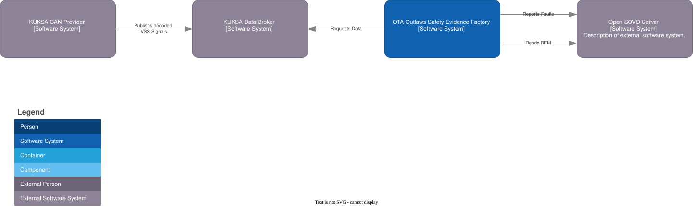
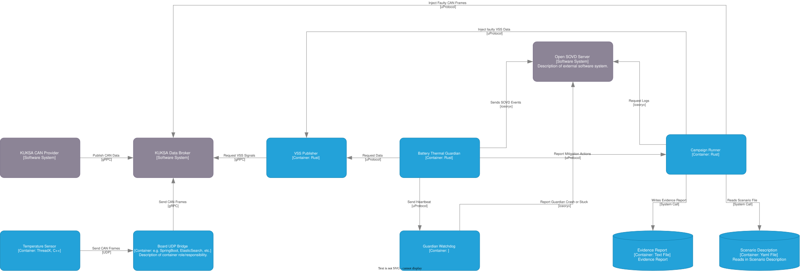
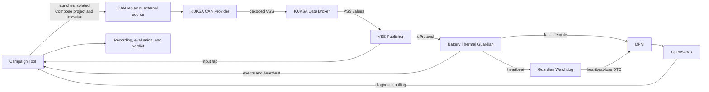

<!--
Copyright (c) 2026 Contributors to the Eclipse Foundation

See the NOTICE file(s) distributed with this work for additional
information regarding copyright ownership.

This program and the accompanying materials are made available under the
terms of the Eclipse Public License 2.0 which is available at
https://www.eclipse.org/legal/epl-2.0

SPDX-License-Identifier: EPL-2.0
-->

# OTA Outlaws Software Architecture

This document follows the 13-part structure from *The Software Architecture
Guidebook* by Simon Brown. Sections with incomplete project information contain
short fill-in patterns; these are prompts, not claims about implemented behavior.

## 1. Context

The Battery Thermal Guardian is part of the OTA Outlaws Safety Evidence Factory.
It evaluates battery temperature data, requests warnings and mitigation, and
produces diagnostic events. The Evidence Collector observes the run and assembles
the evidence and verdict; it is test infrastructure, not part of the vehicle
Guardian.



**External actors and systems:**

| Name | Role |
|---|---|
| KUKSA CAN Provider | Converts CAN frames to VSS signals |
| KUKSA Data Broker | Stores decoded VSS values |
| DFM and OpenSOVD gateway | Store and expose diagnostic records |
| Docker Compose | Runs the local signal chain and isolated campaign projects |
| Ankaios / AutoSD | Intended target runtime; no deployment manifest is currently present |

## 2. Functional Overview

The nominal data path is CAN trace or external sensor -> KUKSA CAN Provider ->
KUKSA Data Broker -> VSS Publisher -> Battery Thermal Guardian over uProtocol.
The Guardian publishes thermal and monitoring events, mitigation requests,
fault events, and a heartbeat over uProtocol. Guardian and watchdog fault
lifecycle records are sent to DFM; the OpenSOVD gateway exposes them to the
campaign tool. The campaign tool is a Rust crate that runs scenarios, records
uProtocol and OpenSOVD observations, evaluates evidence, and writes verdicts.
Python is used by the diagnostics smoke-test harness and trace-generation
scripts, not as a separate scenario generator or evidence collector.

| Responsibility | Owner |
|---|---|
| Temperature thresholds, trend, and hysteresis | Guardian; hot-spot criterion is not implemented |
| Freshness, stuck-value, and plausibility response | Guardian |
| Guardian fault reporting to DFM | Guardian service through the local DFM reporter interface |
| Guardian heartbeat publication | Guardian service, every 500 ms |
| Heartbeat-loss detection and DFM reporting | Separate Rust watchdog; it does not issue an occupant warning or restart a hung Guardian |
| Input/event taps, OpenSOVD polling, timing evaluation, and verdict | Rust campaign tool; attribution is limited to the evidence available at its tap points |
| Fault scenario execution and manifest | Rust campaign tool using `campaign/scenarios.toml`; diagnostics outage is a separate custom smoke-test campaign |

## 3. Quality Attributes

| Attribute | Architectural concern | Source or verification |
|---|---|---|
| Functional safety | Hazards, operating situations, safety goals, and candidate ratings | [HARA risk classification and safety goals](hara.md#risk-classification-and-safety-goals); S/E/C and ASIL remain subject to vehicle/system safety-owner confirmation |
| Safety behavior | Thermal state and monitoring status remain distinct; loss or invalidity must not be interpreted as a safe battery | [HARA-derived requirements](hara.md#derived-functional-requirements) and their current tests in [HARA-derived test scenarios](hara.md#hara-derived-test-scenarios) |
| Timing | Warning, freshness, reaction, and diagnostic visibility have measurable budgets | HARA DFR-1 and test-case budgets; implementation values are in `config/guardian/safety-params.toml` and `campaign/scenarios.toml` |
| Diagnostic observability | Guardian faults can be correlated to DFM and OpenSOVD records | Integration and campaign tests cover selected fault paths; coverage remains incomplete |
| Reproducibility | Fault campaigns can be rerun with the same inputs and expected reactions | Scenario manifest, configured environment, and repeat-run comparison |
| Portability | Guardian logic depends on the uProtocol service contract, not direct broker or CAN-decoder internals | Architecture/interface review and deployment rerun |

The HARA is the safety reference in this repository. It records candidate
hazards and safety goals, derived requirements, and test scenarios. Runtime
parameter values are configured in `config/guardian/safety-params.toml`; the
campaign catalog supplies additional budgets and maps scenarios to HARA tests.
The HARA still contains candidate, unconfirmed risk ratings and requirements
that are not implemented, so those must not be presented as verified behavior.

## 4. Constraints

- The Guardian receives VSS data through the uProtocol service interface and
  does not read the KUKSA Data Broker directly.
- Fault campaigns must be deterministic, replayable, and configured rather than
  relying on machine-specific paths, hosts, or credentials.
- Every campaign verdict must retain its evidence chain from hazard and safety
  goal through fault, detection, mitigation, diagnostics, and verdict.
- Failed scenarios remain visible in campaign reports.
- The project target includes Ankaios-managed deployment; AutoSD/runtime support
  must be verified in the deployment environment rather than assumed from this
  diagram.
- Clearly label functionality that is mocked, simulated, planned, or incomplete.

## 5. Principles

- Keep Guardian safety reactions independent of the Evidence Collector. The
  collector observes; it does not influence Guardian behavior.
- Keep thermal risk and input monitoring trust as separate output dimensions.
- Fail toward warning when uncertain input could represent a real thermal event;
  do not let invalid input lower thermal caution.
- Attribute faults at the layer where evidence supports attribution. Do not make
  the Guardian diagnose causes that are only visible at other tap points.
- Treat interfaces, parameters, and campaign manifests as explicit contracts.
- Record architecture decisions in the decision log below.

## 6. Software Architecture

### Container view




### Component catalog

| Component | Implementation | Documentation |
|---|---|---|
| Temperature source | CAN trace replay through KUKSA CAN Provider; optional MXChip/ThreadX source for manual demonstration | [Campaign Tool](components/campaign.md#hardware-demo); [traces](../../campaign/traces/README.md) |
| VSS Publisher | [vss-publisher](../../vss-publisher) | [Battery Thermal Contract](../../contracts/README.md) |
| Battery Thermal Guardian | Rust core and service adapter: [guardian](../../guardian), [guardian-service](../../guardian-service) | [Battery Thermal Guardian](components/battery-thermal-guardian.md) |
| Campaign runner and evidence collector | Rust crate: [campaign](../../campaign) | [Campaign Tool](components/campaign.md) |
| Diagnostics outage smoke test | Python orchestration harness and diagnostics campaign container | [smoke_test.py](../../diagnostics/smoke_test.py); [run tests](../how-to/run-tests.md) |
| KUKSA Data Broker and CAN Provider | External container images in the Compose signal chain | [Compose deployment](../../docker-compose.yml); [signal-chain guide](../how-to/run-signal-chain.md) |
| DFM and OpenSOVD gateway | External diagnostics image, configured by Docker Compose | [diagnostics setup](../../README.md#interfaces-and-ipc); [DFM catalog](../../diagnostics/catalog/battery_guardian.json) |
| Guardian Watchdog | Rust service: [watchdog](../../watchdog) | [Guardian Watchdog](components/guardian-watchdog.md) |
| Dashboard | Rust web service | [Dashboard](components/dashboard.md) |

### Component design pattern

For each component, document:

| Field | Description |
|---|---|
| Responsibility | One sentence describing what the component owns |
| Interfaces | Provided and required interfaces, protocol, and schema |
| State and lifecycle | Startup, normal operation, degraded behavior, shutdown |
| Dependencies | Other components and configuration required |
| Failure behavior | Detection, reporting, recovery, and supervision |
| Verification | Unit, integration, and campaign tests |

TODO: Add component diagrams where they improve understanding beyond the
container view.

## 7. Code

| Codebase | Language/runtime | Responsibility | Entry point and build/test instructions |
|---|---|---|---|
| [vss-publisher](../../vss-publisher) | Rust | Subscribes to KUKSA VSS data and publishes `BatteryTemperature` over uProtocol | `cargo run -p vss-publisher`; see [contract](../../contracts/README.md) |
| [guardian](../../guardian) and [guardian-service](../../guardian-service) | Rust | Evaluate samples, publish Guardian events/heartbeat, and report DTC lifecycle updates | `cargo test -p guardian -p guardian-service`; service entry point: `guardian-service/src/main.rs` |
| [campaign](../../campaign) | Rust | Runs catalog scenarios, records evidence, evaluates runs, and writes reports | `cargo run -p campaign -- run --all`; [commands and artifacts](components/campaign.md) |
| [watchdog](../../watchdog) | Rust | Monitors Guardian heartbeat and reports heartbeat loss to DFM | `cargo test -p watchdog`; service entry point: `watchdog/src/main.rs` |
| [diagnostics smoke test](../../diagnostics/smoke_test.py) | Python | Orchestrates isolated diagnostics campaigns, including the TS-27 outage case | `python3 diagnostics/smoke_test.py`; [test guide](../how-to/run-tests.md) |

**Code organization pattern:**

- Package/module: `TODO`
- Public interface: `TODO`
- Configuration and parameter loading: `TODO`
- Error handling and diagnostics: `TODO`
- Unit/integration test locations: `TODO`

## 8. Data

### Data flow



### CAN signal contract

Message `BMS_MSG1`, CAN ID `0x500`, DLC 8 bytes, cycle time 100 ms, sent by the
BMS. Byte order is little endian. Temperatures are raw degrees Celsius, factor
1, offset 0.

| Field | Bytes | Bits | Type | Range | Unit |
|---|---|---|---|---|---|
| CellTempMax | 0-1 | 0-15 | `uint16` | 0...255 | °C |
| CellTempMin | 2-3 | 16-31 | `uint16` | 0...255 | °C |
| CellTempAvg | 4-5 | 32-47 | `uint16` | 0...255 | °C |
| Quality | 6 | 48-55 | `uint8` | See quality enum | - |
| AliveCounter | 7 | 56-63 | `uint8` | 0...255 | - |

`AliveCounter` increments on every transmitted frame and wraps at 255. A counter
that stops advancing marks the data as stale even while the last value looks
plausible. The authoritative signal definition is [can/BMS_MSG1_CAN.dbc](../../can/BMS_MSG1_CAN.dbc);
[can/BMS_MSG1_CAN.asc](../../can/BMS_MSG1_CAN.asc) is a sample trace.

### Quality enum

```text
INVALID             = 0x00
VALID               = 0x80
ERROR_NOT_AVAILABLE = 0xFF
```

### VSS mapping

The KUKSA CAN Provider maps these signals as defined in
[can/vss_dbc.json](../../can/vss_dbc.json):

| CAN signal | VSS path | Type |
|---|---|---|
| CellTempMax | `Vehicle.Powertrain.TractionBattery.Temperature.Max` | `float` |
| CellTempMin | `Vehicle.Powertrain.TractionBattery.Temperature.Min` | `float` |
| CellTempAvg | `Vehicle.Powertrain.TractionBattery.Temperature.Average` | `float` |
| Quality | `Vehicle.Powertrain.TractionBattery.BMS.SignalQuality` | `uint8` |
| AliveCounter | `Vehicle.Powertrain.TractionBattery.BMS.AliveCounter` | `uint8` |

The temperature paths are standard VSS. The `BMS` branch is a project-private
extension, not part of the VSS standard catalogue.

### Campaign manifest and evidence identifiers

| Field | Purpose | Status |
|---|---|---|
| `run_id` | Identifies a campaign or observed run | Written by the Rust campaign tool |
| `scenario` | Selects the catalog scenario | Written by the Rust campaign tool; scenario definition and expectations are in `campaign/scenarios.toml` |
| `mode` | `run` for tool-driven stimulus or `observe` for external stimulus | Written by the Rust campaign tool |
| `started_at`, `git_revision` | Run start and repository revision | Written when available |
| `stimulus` | Serialized stimulus configuration | Written by the Rust campaign tool |
| `inputs` | SHA-256 hashes of the catalog, safety parameter file, and trace when applicable | Written by the Rust campaign tool |

The campaign report adds the HARA hazard/safety-goal references and evaluation.
There is no single `correlation_id` field: evidence is related through the run
and scenario, Guardian `session_id`, `event_id` and `cause_event_id`, and the
session/event metadata in DFM/OpenSOVD records. Scenario expectations are stored
in the TOML catalog, not duplicated in the manifest. The separate custom
diagnostics smoke campaign for [HARA TS-27](hara.md#ts-27-source-loss-during-dfmopensovd-outage)
is the `outage` case in [diagnostics/smoke_test.py](../../diagnostics/smoke_test.py);
it is not currently an entry in `campaign/scenarios.toml`.

## 9. Infrastructure Architecture

| Infrastructure element | Purpose | Current details or open point |
|---|---|---|
| Developer host with Docker Compose | Runs the demonstrated signal chain, diagnostics, dashboard, and campaign projects | Configuration is in `docker-compose.yml`; environment-specific host ports can be overridden |
| CAN trace replay / optional MXChip source | Supplies temperature frames | Automated scenarios replay checked-in ASC traces; the board is an external/manual source |
| Zenoh, KUKSA CAN Provider, and Data Broker | Route uProtocol and decode/store VSS data | Container services in `docker-compose.yml`; Guardian receives data only through the uProtocol contract |
| Guardian and Watchdog | Evaluate temperature data and supervise Guardian heartbeat | Separate Rust containers; DFM IPC and Zenoh transport are configured in Compose |
| DFM and OpenSOVD gateway | Store and expose diagnostic records | External image and local IPC; Compose ports/configuration are environment-specific |
| Network and Docker socket | Connect services; dashboard controls Docker | Trust boundaries, production credentials, and hardened deployment controls remain unspecified |
| HPC / AutoSD | Intended deployment target | Hardware/OS profile and runnable target deployment are not yet represented by checked-in manifests |

TODO: Add an infrastructure diagram showing nodes, networks, trust boundaries,
and external services when the target environment is finalized.

## 10. Deployment

| Target | Component |
|---|---|
| Developer host (Docker Compose) | Zenoh router, KUKSA CAN Provider, KUKSA Data Broker, VSS Publisher, Battery Thermal Guardian, Guardian Watchdog, DFM, OpenSOVD gateway, and dashboard |
| Developer host (campaign project) | Rust campaign runner and evidence recorder; starts an isolated Compose project per catalog scenario |
| MXChip device (optional/manual) | External ThreadX temperature source for the `campaign observe` demonstration |
| HPC (AutoSD with Ankaios; target) | Intended deployment for vehicle-side services; no checked-in Ankaios/AutoSD deployment manifests or verified target run |

The local Docker Compose deployment is the implemented runtime. Docker restarts
a crashed Guardian according to its Compose policy; a hung Guardian is observed
by the separate watchdog but is not restarted. Campaign execution uses separate
Compose projects rather than Ankaios. Resource limits, production trust
boundaries, and the target deployment remain open.

## 11. Operation and Support

| Operational concern | Current approach | Open item |
|---|---|---|
| Guardian health | Guardian publishes a heartbeat every 500 ms; watchdog reports loss after the configured 1500 ms timeout | Watchdog reports a DTC; it does not issue an occupant warning or restart a hung Guardian; see [HARA DFR-5](hara.md#derived-functional-requirements) |
| Monitoring degradation | Guardian publishes monitoring status and a `DRIVER_WARNING_MONITORING_UNAVAILABLE` request | This is an event/request, not proof of a physical warning; see [HARA SG-2](hara.md#risk-classification-and-safety-goals) and [DFR-2](hara.md#derived-functional-requirements) |
| Diagnostics | Guardian and watchdog report lifecycle records to DFM; OpenSOVD exposes them | Campaign tool polls visibility; delivery is asynchronous; see [Campaign Tool](components/campaign.md#evidence-collector-to-opensovd) |
| Campaign execution | Rust campaign tool runs catalog scenarios; `diagnostics/smoke_test.py` runs the custom diagnostics suite including TS-27 | See [Campaign Tool](components/campaign.md) and [run tests](../how-to/run-tests.md) |
| Evidence and failed runs | Campaign reports preserve PASS, FAIL, and INCONCLUSIVE results and logs | Output locations and retention are described in [Campaign Tool](components/campaign.md#a-run) |
| Recovery | Guardian recovers on valid input; Docker restarts a crashed process; watchdog only detects a hang | No hung-process restart or independent occupant warning is implemented |

**Runbook pattern:**

- Start condition: `TODO`
- Health checks: `TODO`
- Expected logs/diagnostics: `TODO`
- Recovery/escalation: `TODO`
- Stop and cleanup: `TODO`

## 12. Development Environment

| Area | Pattern to complete |
|---|---|
| Host prerequisites | OS, toolchains, container runtime, and hardware access: `TODO` |
| Build | Per-component build commands and required environment: `TODO` |
| Tests | Unit, integration, and campaign commands: `TODO` |
| Local services | Broker, publisher, Guardian, DFM/OpenSOVD setup: `TODO` |
| Configuration | Example config, parameter source, and secret handling: `TODO` |
| CI | Workflows, required checks, and artifact publication: `TODO` |
| Reproduction | Clean-checkout procedure and expected baseline result: `TODO` |

## 13. Decision Log

Record decisions that materially affect interfaces, deployment, safety behavior,
or quality attributes. Link each decision to relevant requirements and code.

| ID | Date | Status | Context | Decision | Consequences | Owner |
|---|---|---|---|---|---|---|
| `ADR-XXX` | `YYYY-MM-DD` | Proposed/Accepted/Deprecated | `Problem and forces` | `Chosen option and rationale` | `Trade-offs and follow-up` | `Name/team` |

The scenario catalog and the run manifest are described in the
[Campaign Tool](components/campaign.md#scenario-catalog).

## AI Assistance

The original C4 diagrams and component overview were created with the assistance
of **Claude Code** using the model **Claude Opus 5.5**
(`claude-opus-5-5`).

The CAN signal and VSS mapping material was updated with the assistance of
**Claude Code** using the model **Claude Opus 5** (`claude-opus-5`).

This document was reorganized with the assistance of **GitHub Copilot** using
the model **GPT-6 Luna**.

The implementation alignment, campaign/evidence description, and deployment
view were updated with the assistance of **GitHub Copilot** using the model
**GPT-6 Luna**.
