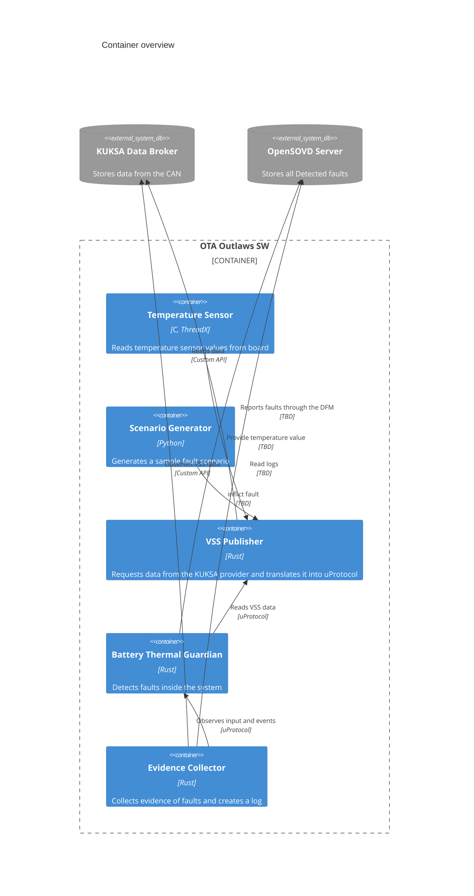

<!--
Copyright (c) 2026 Contributors to the Eclipse Foundation

See the NOTICE file(s) distributed with this work for additional
information regarding copyright ownership.

This program and the accompanying materials are made available under the
terms of the Eclipse Public License 2.0 which is available at
https://www.eclipse.org/legal/epl-2.0

SPDX-License-Identifier: EPL-2.0
-->

# High Level Overview


# Components View

|Component Name|Code|Documentation|
|---|---|---|
|Temperature Sensor|||
|Scenario Generator|[Fault_Injection_CAN_Logs](../../Fault_Injection_CAN_Logs), [diagnostics](../../diagnostics)|[Scenario Generator](components/scenario-generator.md)|
|VSS Publisher|[vss-publisher](../../vss-publisher)|[Battery Thermal Contract](../../contracts/README.md)|
|Battery Thermal Guardian|[guardian](../../guardian), [guardian-service](../../guardian-service)|[Battery Thermal Guardian](components/battery-thermal-guardian.md)|
|Evidence Collector|planned|[Evidence Collector](components/evidence-collector.md)|
|KUKSA Data Broker|||
|OpenSOVD Server|||



# Responsibilities: Guardian and Evidence Collector

The Battery Thermal Guardian and the Evidence Collector both look at faults, but
for different reasons. The Guardian **protects**: it warns the occupants. The
Evidence Collector **explains and proves**: it finds out what happened and
whether the reaction was correct.

| | Battery Thermal Guardian | Evidence Collector |
|---|---|---|
| Purpose | Warn the occupants | Explain what happened and judge the reaction |
| Exists in a real vehicle | Yes | No, it is test infrastructure |
| Timing | Real time, within milliseconds | After the fact |
| What it sees | Only its own uProtocol input | Several tap points (Data Broker, VSS Publisher output, Guardian input), Guardian events, OpenSOVD, and the scenario manifest |
| Clock | Its own; cannot compare times across hosts | One clock for all its tap points |
| Knows about scenarios | No; it behaves the same with or without a test | Yes: run ID, injected faults, expected reactions |
| If it fails | Hazard: the occupants are not warned | Missing evidence: the verdict is INCONCLUSIVE |
| Design goal | Small, simple, verifiable | Thorough; may be complex |

**Rule of thumb:** if it changes what the occupants are told, it belongs in the
Guardian. If it explains what happened, it belongs in the Evidence Collector.

| Task | Owner |
|---|---|
| Thresholds, trend, hot spot, hysteresis | Guardian |
| Loss of fresh data, stuck values, implausible values | Guardian |
| Writing faults to the DFM | Guardian |
| Guardian heartbeat | Guardian publishes it; the Evidence Collector records a missing heartbeat as a Guardian failure |
| Attributing a data loss to source, VSS Publisher, or transport | Evidence Collector |
| Diagnosing duplicated, reordered, or missing messages by sequence number | Evidence Collector; the Guardian only ignores samples that are not fresh |
| Measuring delays and detection latencies | Evidence Collector |
| Checking that faults are visible through OpenSOVD | Evidence Collector |
| Correlating the scenario manifest, Guardian events, and diagnostics; the verdict | Evidence Collector |

Anything that protects the occupants stays in the Guardian, even where the
Evidence Collector could detect it better: the Evidence Collector is not part of
the vehicle.

The **Scenario Generator** fills the *campaign runner* role: it executes the
scenarios and writes the manifest. Until it is automated, a person can fill this
role by following the written scenario.

The requirements behind this split are in the
[Safety Concept](../explanation/safety-concept.md): FSR requirements for the
Guardian, EC requirements for the Evidence Collector.

# Data Flow

```mermaid
flowchart LR
    SG["Scenario Generator<br/>Python, seed"]
    ASC[".asc + .dbc<br/>faults live in the .asc"]
    CAN["KUKSA CAN Provider<br/>DBC decode → VSS"]
    DB["KUKSA Data Broker<br/>VSS signal store"]
    BR["vss-bridge<br/>VSS → uProtocol"]
    MAN["Scenario manifest<br/>injection time, correlation_id"]
    COL["Evidence Collector<br/>collects, correlates"]
    GUARD["Battery Thermal Guardian<br/>states, plausibility"]
    REP["Verdict + report<br/>JSON + Markdown/HTML"]
    SOVD["OpenSOVD Server<br/>faults over HTTP"]
    DFM["DFM (fault-lib)<br/>fault storage"]

    SG -->|writes| ASC
    SG -->|inflicts fault| BR
    ASC -->|replay| CAN
    CAN -->|gRPC| DB
    DB -->|gRPC| BR
    BR -->|uProtocol| GUARD
    MAN --> COL
    GUARD -->|heartbeat/fault/mitigation| COL
    GUARD --> DFM
    DFM --> SOVD
    SOVD --> COL
    COL --> REP
```



# Deployment

|Deployment Target|Component Name|
|---|---|
|MXCHIP|Temperature Sensor|
|HPC|Scenario Generator|
|HPC|KUKSA Data Broker|
|HPC|VSS Publisher|
|HPC|Battery Thermal Guardian|
|HPC|OpenSOVD Server|
|HPC|Evidence Collector|

# Misc

## CAN Signals

Message `BMS_MSG1`, CAN ID `0x500`, DLC 8 bytes, cycle time 100 ms, sent by the
BMS. Byte order is little endian. Temperatures are transmitted as raw degrees
Celsius, factor 1 and offset 0.

| Field Name | Bytes | Bits | Datatype | Range | Unit |
|---|---|---|---|---|---|
| CellTempMax | 0-1 | 0-15 | `uint16` | 0...255 | °C |
| CellTempMin | 2-3 | 16-31 | `uint16` | 0...255 | °C |
| CellTempAvg | 4-5 | 32-47 | `uint16` | 0...255 | °C |
| Quality | 6 | 48-55 | `uint8` | see below | – |
| AliveCounter | 7 | 56-63 | `uint8` | 0...255 | – |

`AliveCounter` is incremented on every transmitted frame and wraps at 255. A
counter that stops advancing marks the data as stale even while the last value
still looks plausible.

The authoritative definition is [can/BMS_MSG1_CAN.dbc](../../can/BMS_MSG1_CAN.dbc);
[can/BMS_MSG1_CAN.asc](../../can/BMS_MSG1_CAN.asc) is a sample trace of this message.

## Quality Enum

```
INVALID             = 0x00
VALID               = 0x80
ERROR_NOT_AVAILABLE = 0xFF
```

## VSS Mapping

The KUKSA CAN Provider maps the CAN signals to the VSS paths below, as defined in
[can/vss_dbc.json](../../can/vss_dbc.json):

| CAN signal | VSS path | Datatype |
|---|---|---|
| CellTempMax | `Vehicle.Powertrain.TractionBattery.Temperature.Max` | `float` |
| CellTempMin | `Vehicle.Powertrain.TractionBattery.Temperature.Min` | `float` |
| CellTempAvg | `Vehicle.Powertrain.TractionBattery.Temperature.Average` | `float` |
| Quality | `Vehicle.Powertrain.TractionBattery.BMS.SignalQuality` | `uint8` |
| AliveCounter | `Vehicle.Powertrain.TractionBattery.BMS.AliveCounter` | `uint8` |

The three temperature paths are standard VSS. The `BMS` branch is a
project-private extension and not part of the VSS standard catalogue.

## Manifest Structure

The scenario catalog and the run manifest are described in the
[Scenario Generator](components/scenario-generator.md#scenario-catalog).

## AI Assistance

The section "Responsibilities: Guardian and Evidence Collector" was created with
the assistance of **Claude Code** using the model **Claude Opus 5.5**
(`claude-opus-5-5`).

The sections "CAN Signals", "Quality Enum" and "VSS Mapping" were updated to the
`BMS_MSG1` definition with the assistance of **Claude Code** using the model
**Claude Opus 5** (`claude-opus-5`).

The "Manifest Structure" section and the Evidence Collector and Scenario
Generator entries were updated with the assistance of **Claude Code** using the
model **Claude Opus 5.5** (`claude-opus-5-5`).
